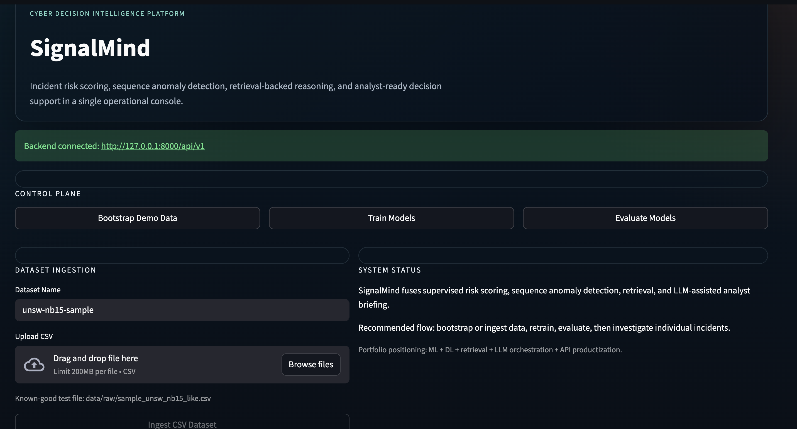
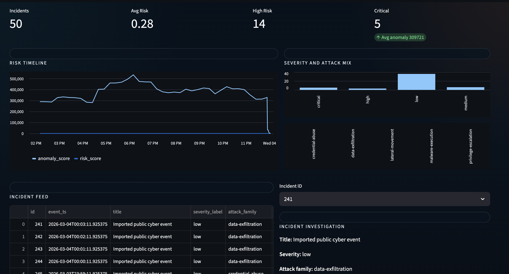
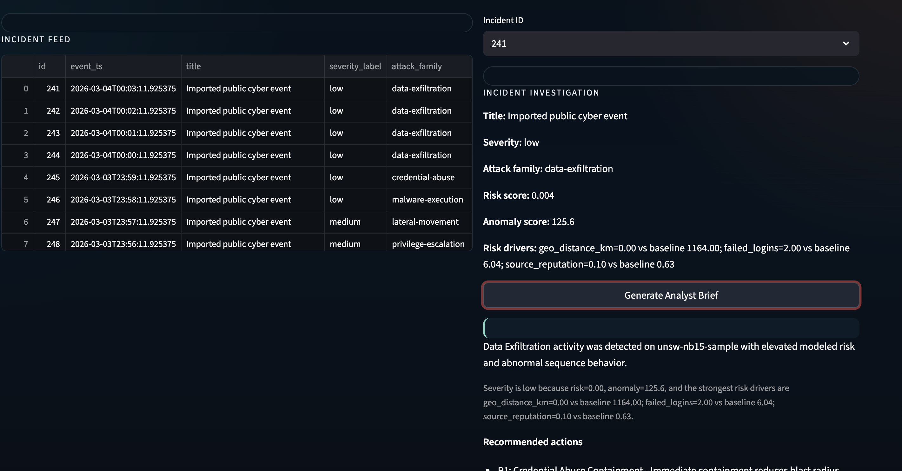
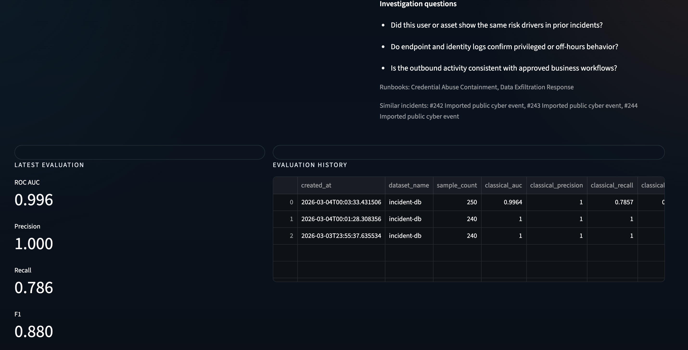
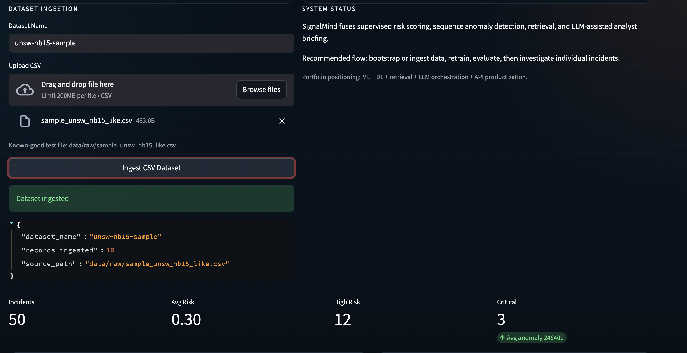
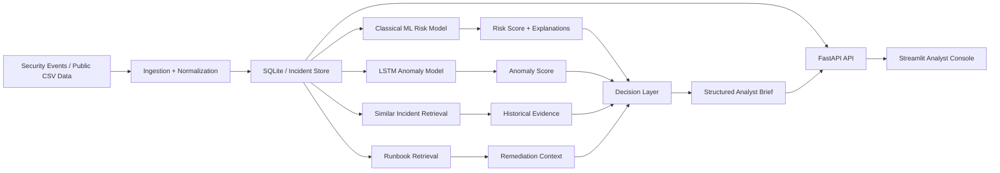

# SignalMind

SignalMind is an AI-powered cybersecurity incident intelligence platform that combines supervised risk scoring, sequential anomaly detection, retrieval, explainability, and structured decision generation.

It is built to demonstrate production-grade AI engineering across backend systems, model training, evaluation, and analyst-facing product design.

## Overview

SignalMind is designed as a cyber incident intelligence system rather than a single-model demo.

It supports an end-to-end workflow:

- ingest security events or public cyber CSV data
- score incident risk with a classical ML model
- detect temporal anomalies with a sequence model
- retrieve similar incidents and remediation runbooks
- generate structured analyst decisions with rationale, evidence, and actions
- expose the workflow through a backend API and an analyst console

## What SignalMind Demonstrates

- Production-oriented FastAPI backend design
- SQLAlchemy-based persistence with SQLite and Postgres-ready structure
- Classical ML risk modeling with `HistGradientBoostingClassifier`
- Sequential anomaly detection with a PyTorch LSTM autoencoder
- Public cyber dataset ingestion and schema normalization
- Persisted evaluation runs with risk and anomaly metrics
- Retrieval of similar incidents and runbooks
- Structured decision generation with evidence, rationale, actions, and investigation questions
- Explainability through top risk-driver summaries
- Analyst-facing Streamlit console with KPIs, charts, evaluation history, and incident drill-down

## Screenshots

### Analyst Console Overview


### Incident Investigation


### Structured Analyst Brief


### Evaluation Console


### Dataset Ingestion


## Architecture Overview



### Backend

- `FastAPI` API layer for ingestion, training, evaluation, incident listing, and decision generation
- `SQLAlchemy` ORM with SQLite for local runs and a design that can move to Postgres
- Service layer for data generation, ingestion, retrieval, model orchestration, and decision logic

### AI Stack

- Classical ML:
  - `HistGradientBoostingClassifier` for incident risk scoring
- Deep Learning:
  - `PyTorch LSTM autoencoder` for temporal anomaly scoring
- Decision Intelligence:
  - structured prompt + provider abstraction + fallback decision synthesis
- Retrieval:
  - similar incident lookup
  - runbook retrieval for remediation guidance

### Data Strategy

SignalMind uses a hybrid data strategy:

1. Synthetic SOC-style incidents for reproducible local demos and fast end-to-end testing
2. Public cyber CSV ingestion for realism and benchmark-oriented experimentation

Current public-data path is designed around normalized CSV imports inspired by datasets such as:

- `UNSW-NB15`
- `CIC-IDS2017`

The repo includes a small bundled sample file for local validation:

- `data/raw/sample_unsw_nb15_like.csv`

## Key Features

- End-to-end cyber incident workflow from ingestion to analyst brief
- Risk and anomaly scoring on the same incident stream
- Stored evaluation metrics for repeatable experiments
- Explainable risk summaries at the incident level
- Structured decision objects instead of a plain narrative blob
- SOC-style dashboard for demo and portfolio presentation

## Repository Structure

```text
SignalMind/
├── app/
│   ├── api/            # FastAPI routes
│   ├── core/           # config and settings
│   ├── db/             # ORM models and session setup
│   ├── llm/            # decision-generation abstractions
│   ├── ml/             # classical and sequence models
│   ├── retrieval/      # similar-incident retrieval
│   ├── schemas/        # Pydantic contracts
│   └── services/       # orchestration and business logic
├── dashboard/          # Streamlit analyst console
├── data/               # raw, processed, and model artifacts
├── docs/               # architecture notes and screenshots
├── scripts/            # local utility scripts
└── tests/              # test suite
```

## Quick Start

### 1. Create a virtual environment

```bash
python3 -m venv .venv
source .venv/bin/activate
```

### 2. Install dependencies

```bash
pip install -e '.[dev]'
```

If editable install fails because your packaging tools are old, upgrade them first:

```bash
python -m pip install --upgrade pip setuptools wheel
```

### 3. Start the backend

```bash
uvicorn app.main:app --reload
```

### 4. Start the dashboard

In a second terminal:

```bash
source .venv/bin/activate
streamlit run dashboard/app.py
```

## Demo Workflow

### Synthetic demo

1. Click `Bootstrap Demo Data`
2. Click `Train Models`
3. Click `Evaluate Models`
4. Select an incident
5. Click `Generate Analyst Brief`

This flow is for the default local demo path using synthetic SOC-style incidents.

### Public CSV demo

1. Start the backend and dashboard
2. In the dashboard, use the bundled sample:
   - `data/raw/sample_unsw_nb15_like.csv`
3. Upload it in `Dataset Ingestion`
4. Click `Ingest CSV Dataset`
5. Click `Train Models`
6. Click `Evaluate Models`
7. Investigate an imported incident and generate the brief

This flow is for showing that the system can ingest and score public-style cybersecurity data, not only synthetic demo records.

## API Surface

### Health

- `GET /api/v1/health`

### Data

- `POST /api/v1/bootstrap/demo-data`
- `POST /api/v1/datasets/ingest`
- `GET /api/v1/incidents`
- `GET /api/v1/incidents/{incident_id}`

### Models

- `POST /api/v1/models/train`
- `POST /api/v1/models/evaluate`
- `GET /api/v1/models/evaluations`

### Decision Support

- `POST /api/v1/incidents/{incident_id}/brief`

## Example Outcome

For a single incident, SignalMind can produce:

- predicted risk score
- sequence anomaly score
- top risk drivers
- similar historical incidents
- recommended runbooks
- structured analyst decision with summary, severity rationale, evidence, recommended actions, and investigation questions

## Roadmap

- Add stronger benchmark ingestion adapters
- Add experiment tracking and richer reporting
- Add Docker and CI
- Add architecture diagram
- Add real LLM provider integrations behind the existing provider abstraction
- Add deeper tests for API and workflow coverage

## Tech Stack

- Python
- FastAPI
- SQLAlchemy
- SQLite
- Pandas
- scikit-learn
- PyTorch
- Streamlit

## Notes

- This repo is intentionally runnable locally without external LLM credentials
- The current decision layer defaults to a mock provider plus a structured fallback path, so the project remains runnable without API keys
- Synthetic metrics can look overly strong; imported public-style data is the more realistic demo path
